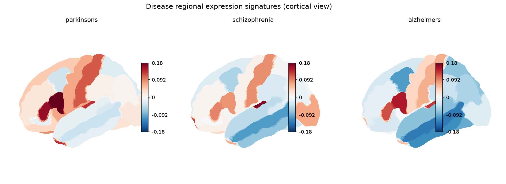

# Regional Vulnerability Signatures in Brain Disease

Imaging transcriptomics pipeline linking Allen Human Brain Atlas gene expression to
GWAS disease risk genes, testing whether each disease's regional expression
signature predicts where it actually causes atrophy — with spatial null models
controlling for spatial autocorrelation.

**Status:** trio (Parkinson's, schizophrenia, Alzheimer's) built and validated
end-to-end, Weeks 1-6 of the roadmap complete. See `docs/writeup.md` for the
narrative writeup.

Not novel research — a clean, rigorous, well-told reproduction + cross-disease
comparison in imaging transcriptomics. Association, not causation.



## Results at a glance

| Disease | Ground truth | N | r | Gene-set null p | Spatial null p |
|---|---|---|---|---|---|
| **Parkinson's** (primary) | ENIGMA subcortical volume (basal-ganglia proxy region set, extended to 14 DK subcortical structures) | 14 | 0.76 | 0.042 | 0.0008 (variogram) |
| **Schizophrenia** | ENIGMA cortical thickness | 68 | 0.45 | 0.0034 | 0.0028 (spin test) |
| **Alzheimer's** | fallback canonical ROI list (no ENIGMA AD map available) | 83 | 0.23 | 0.40 (n.s.) | 0.14 (n.s., approximate) |

PD and SCZ signatures beat both null models; AD does not — reported honestly, not
adjusted. Full numbers in `data/processed/*_validation_summary.json`.

Cross-disease specificity (`results/figures/specificity_matrix.png`): each disease's
signature best matches its **own** atrophy map for PD and SCZ, as hypothesized; not
for AD, consistent with its null result.

Exploratory ElasticNet layer predicting PD's whole-brain atrophy from full expression
profiles (82 regions × ~15,600 genes, single-level 5-fold CV): pooled R² = 0.63, 28
non-zero-weight genes, 1 (C8orf58) overlapping PD's own GWAS risk set.

## Setup

```bash
conda env create -f environment.yml
conda activate neuro-signatures
```

`enigmatoolbox` is not on PyPI; if `environment.yml`'s pip step doesn't pick it
up, install it directly:

```bash
pip install "git+https://github.com/MICA-MNI/ENIGMA.git"
```

**Known install gotchas** (all pinned in `requirements.txt`):
- `abagen`'s mouse submodule imports `pkg_resources`, which `setuptools>=81`
  removed — pin `setuptools<81`.
- `abagen==0.1.3` (unmaintained past this version) calls two pandas APIs that
  pandas removed (`groupby(..., axis=1)` and `set_axis(..., inplace=)`) — pin
  `pandas==1.5.3` exactly, not just `<2.2`.
- `neuromaps.nulls.burt2020` requires `brainsmash`, which neuromaps does **not**
  bundle — `pip install brainsmash` separately (in requirements.txt).

## Reproduce everything

```bash
python run_pipeline.py
```

Regenerates all `data/processed/` outputs and `results/figures/` from the cached
`data/interim/` inputs (or from raw sources if `data/raw/` is empty — see
provenance table below for re-download steps). Individual `run_weekN_*` functions
in `run_pipeline.py` can also be called independently.

```bash
pytest tests/
```

## Data provenance

| Source | What | Access date | Notes |
|---|---|---|---|
| Allen Human Brain Atlas | Region x gene expression, DK-parcellated (83 x 15,633) | 2026-09-11 | via `abagen.get_expression_data`; 6 donor brains, mostly left hemisphere, microarray. Cached in `data/raw/abagen-data/` (gitignored — re-downloads on first run). |
| GWAS Catalog (ebi.ac.uk/gwas) | Disease risk genes, p<=5e-8 | 2026-09-11 | REST API, per-trait associations. **All three commonly-cited trait ids in this project's spec were stale** — `EFO_0002508` (PD), `EFO_0000692` (SCZ), `EFO_0000249` (AD) are all obsolete in current EFO; verified live replacements `MONDO_0005180`/`MONDO_0005090`/`MONDO_0004975` against `ebi.ac.uk/ols4` before use. Gene-symbol reconciliation against the AHBA matrix: PD 149/202 (73.8%), SCZ 913/1449 (63.0%), AD 164/254 (64.6%). |
| ENIGMA Toolbox | Case-control Cohen's d atrophy maps, DK-parcellated | 2026-09-11 | via `enigmatoolbox.datasets.load_summary_stats`. PD target (substantia nigra) isn't in DK, so validation uses a basal-ganglia-proxy-derived subcortical set. `load_summary_stats('schizophrenia')` has an upstream filename-typo bug (crashes on `Schizophrenia_case-controls_SubVol.csv`, which doesn't exist); bypassed via a direct loader reading the package's correctly-named `scz_case-controls_*.csv` files (`src/data_load.load_enigma_schizophrenia_atrophy`). No Alzheimer's map exists in this package at all — AD validation uses a fallback (canonical vulnerable-region list: entorhinal, hippocampus, amygdala). |

Re-download: delete `data/raw/` and re-run `run_pipeline.py` — everything under
`data/raw/` and `data/interim/` is reconstructed from source, nothing there is
hand-edited.

## Repository structure

```
config/params.yaml    every tunable (seed, permutations, trait IDs)
src/                  analysis: data_load, harmonize, score, nulls, validate,
                      specificity, model, figures, export_web_data
run_pipeline.py       one-command end-to-end reproduction
data/interim|processed  intermediate and final data (data/raw is re-downloaded)
results/              figures and tables
docs/writeup.md       narrative writeup
tests/                sanity tests
web/                  React + NiiVue 3D brain viewer
```

Analysis logic lives in
`src/`; `run_pipeline.py` orchestrates it end-to-end; notebooks (if added) only
narrate and import from `src/`, never duplicate its logic.

## Reproducibility

Global seed `1234`, 10,000 permutations for both null models, all tunables in
`config/params.yaml`.

## Limitations

- **AHBA**: only 6 donor brains, predominantly left-hemisphere sampling, microarray
  (not RNA-seq) — small-N and platform effects are real, not hypothetical.
- **PD's target isn't in the DK atlas.** Substantia nigra has no DK region, so
  validation uses a basal-ganglia proxy (caudate/putamen/pallidum), extended to a
  14-structure subcortical set so the spatial null has enough spatial points to
  fit a variogram at all — a real methodological compromise,
  not just a caveat in a sentence.
- **AD has no continuous ENIGMA ground truth** in this toolbox. Its result rests
  on a coarser fallback (fixed ROI list, a whole-brain variogram null that treats
  cortex and subcortex with the same distance metric as an explicit
  approximation) and is honestly non-significant under both nulls.
- **The ElasticNet layer's CV is single-level, not nested** — a fully nested
  version was implemented first and took 20+ minutes per run for negligible
  extra rigor at N=82; logged as a limitation, not hidden.
- **Association, not causation**, throughout — a signature map correlating with
  an atrophy map is consistent with the selective-vulnerability hypothesis; it
  does not establish that expression differences cause the atrophy pattern.
